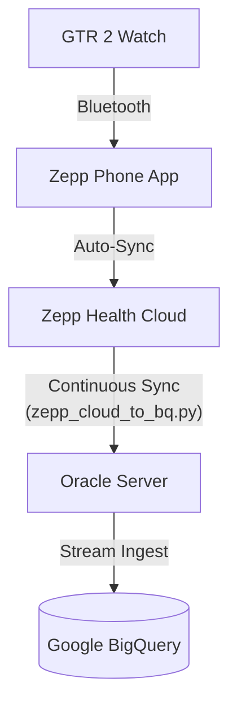

# Zepp OS Oracle Server Sync (Cloud-to-BigQuery)

This directory contains the Python extraction pipeline specifically designed for **legacy devices (like the Amazfit GTR 2)** that do not support Zepp OS Mini-Programs. 

Since these watches cannot push data directly, this service acts as a continuous background daemon on an Oracle VM. It securely pulls health data (PAI, Steps, Sleep, Heart Rate) from the Zepp Cloud APIs and streams it into Google BigQuery.

## 🏗️ Architecture



### Key Features
1. **Zero Password Storage:** Your Zepp account password is **never** stored in plaintext or in any `.env` file. It is retrieved securely at runtime from **Google Cloud Secret Manager**.
2. **Rate Limit Evasion:** The Zepp API strictly limits login attempts (HTTP 429). This script caches the access token (`.zepp_token_cache.json`) and bypasses the login endpoint entirely until the token expires (~30 days).
3. **Data Parity:** Parses the undocumented base64 `band_data` blob to extract minute-level sleep and step metrics alongside PAI.

---

## 🚀 Installation & Setup Guide

### 1. Prerequisites
- Python 3.11+
- A Google Cloud Project with Billing Enabled.
- Google BigQuery and Secret Manager APIs enabled.

### 2. Google Cloud Setup

**A. Create the BigQuery Dataset & Tables:**
```bash
# Create dataset
bq mk zepp_health_data

# Create PAI table
bq mk --table your-project-id:zepp_health_data.pai_data timestamp:TIMESTAMP,date:STRING,total_pai:FLOAT,daily_pai:FLOAT,max_hr:INTEGER,rest_hr:INTEGER

# Create Band Data (Steps/Sleep) table
bq mk --table your-project-id:zepp_health_data.band_data timestamp:TIMESTAMP,date:STRING,steps:INTEGER,deep_sleep_minutes:INTEGER,light_sleep_minutes:INTEGER
```

**B. Store your Zepp Password Securely:**
You must store your Zepp account password in GCP Secret Manager. Do **not** hardcode it anywhere.
```bash
echo -n "YourZeppPassword" | gcloud secrets create zepp-password --data-file=- --project=your-project-id
```

### 3. Local Environment Setup

Clone the repository and set up the virtual environment:
```bash
cd oracle-server-sync
python3 -m venv .venv
source .venv/bin/activate
pip install -r requirements-bq.txt
```

Create a `.env` file for non-sensitive configurations:
```bash
# .env (This file is ignored by Git)
ZEPP_EMAIL=your.email@gmail.com
GCP_PROJECT_ID=your-project-id
GCP_SECRET_NAME=zepp-password
BQ_DATASET=zepp_health_data
```

Authenticate the Oracle Server with Google Cloud:
```bash
gcloud auth application-default login
```

### 4. Running the Pipeline

**Historical Backfill:**
To fetch the last 1 year of data and backfill your BigQuery tables, run the backfill script once:
```bash
python zepp_bq_backfill.py
```
*(This script fetches data in 7-day chunks and sleeps between requests to strictly obey Zepp rate limits).*

**Continuous Sync (Production):**
To start the continuous background daemon that fetches data every hour:
```bash
nohup python zepp_cloud_to_bq.py > sync.log 2>&1 &
```

---

## 🛡️ Security & Compliance
- **.gitignore:** The `.env` and `.zepp_token_cache.json` files contain sensitive tokens and are excluded from version control.
- **Secret Manager:** Ensure the service account running the Python script on the Oracle VM has the `Secret Manager Secret Accessor` IAM role.
