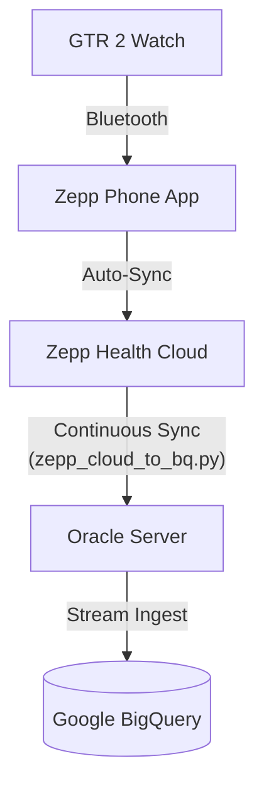

# Zepp OS Oracle Server Sync (Cloud-to-BigQuery)

This directory contains the Python extraction pipeline specifically designed for **legacy devices (like the Amazfit GTR 2)** that do not support Zepp OS Mini-Programs. 

Since these watches cannot push data directly, this service acts as a continuous background daemon on an Oracle VM. It securely pulls health data (PAI, Steps, Sleep, Heart Rate) from the Zepp Cloud APIs and streams it into Google BigQuery.

## 🏗️ Architecture



### Key Features
1. **Zero Password Storage:** Your Zepp account password is **never** stored in plaintext or in any `.env` file. It is retrieved securely at runtime from **Google Cloud Secret Manager**.
2. **Rate Limit Evasion:** The Zepp API strictly limits login attempts (HTTP 429). This script caches the access token (`.zepp_token_cache.json`) and bypasses the login endpoint entirely until the token expires (~30 days).
3. **Data Parity:** Parses the undocumented base64 `band_data` blob to extract minute-level sleep and step metrics alongside PAI.

---

## 🚀 Installation & Setup Guide

### 1. Prerequisites
- Python 3.11+
- A Google Cloud Project with Billing Enabled.
- Google BigQuery and Secret Manager APIs enabled.

### 2. Google Cloud Setup

**A. Create the BigQuery Dataset & Tables:**
```bash
# Create dataset
bq mk zepp_health_data

# Create PAI table
bq mk --table your-project-id:zepp_health_data.pai_data timestamp:TIMESTAMP,date:STRING,total_pai:FLOAT,daily_pai:FLOAT,max_hr:INTEGER,rest_hr:INTEGER

# Create Band Data (Steps/Sleep) table
bq mk --table your-project-id:zepp_health_data.band_data timestamp:TIMESTAMP,date:STRING,steps:INTEGER,deep_sleep_minutes:INTEGER,light_sleep_minutes:INTEGER
```

**B. Store your Zepp Password Securely:**
You must store your Zepp account password in GCP Secret Manager. Do **not** hardcode it anywhere.
```bash
echo -n "YourZeppPassword" | gcloud secrets create zepp-password --data-file=- --project=your-project-id
```

### 3. CI/CD & Production Deployment

This pipeline is designed to be completely zero-touch and is deployed via GitHub Actions.

**A. Add GitHub Secrets:**
To authorize the deployment to your Oracle VM and authenticate with Google/Grafana, add the following secrets to your GitHub Repository:

- **Oracle SSH Config:** `ORACLE_HOST`, `ORACLE_USERNAME`, `ORACLE_SSH_KEY`
- **Google Cloud Auth:** `GCP_SA_KEY_JSON` (A Service Account Key with BigQuery Data Editor and Secret Manager Accessor roles)
- **Grafana Cloud Telemetry:** `GRAFANA_PROMETHEUS_URL`, `GRAFANA_PROMETHEUS_USER`, `GRAFANA_LOKI_URL`, `GRAFANA_LOKI_USER`, `GRAFANA_CLOUD_API_KEY`

**B. Deploy:**
Simply commit and push your code to the `main` branch. GitHub Actions will automatically:
1. Install Docker on the Oracle VM.
2. Clone the repository.
3. Build the Docker container.
4. Launch both the `zepp-oracle-sync` daemon and the `grafana-alloy` sidecar.

---

## 📈 Grafana Cloud Telemetry
This project includes a **Grafana Alloy** sidecar container (`config.alloy`) that automatically monitors the Oracle VM without exposing any ports:
- **Host Metrics:** Tracks CPU, RAM, and Disk space of the Oracle VM.
- **Docker Logs:** Streams all Python logs (`stdout`/`stderr`) directly into Grafana Loki, allowing you to search your live production logs from the Grafana dashboard.

---

## 🛡️ Security & Compliance
- **.gitignore:** The `.env` and `.zepp_token_cache.json` files contain sensitive tokens and are excluded from version control.
- **No Hardcoded Passwords:** The pipeline uses GitHub Secrets to inject environment variables securely during deployment.
